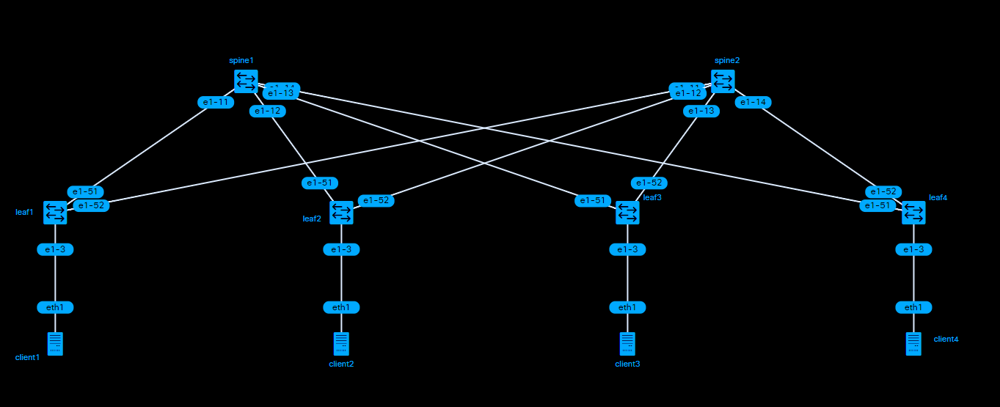

# SR Linux Tier-2 CLOS topology with Container Lab

Example based on  https://containerlab.dev/lab-examples/clos03/

## Prerequisites:

* A Linux VM or Hypervisor and following tools:
  * A Linux container runtime like [Docker](https://docs.docker.com/get-docker/)
  * Internet Connection
  * [containerlab](https://containerlab.dev/)
  * [gNMIC](https://gnmic.kmrd.dev/)


## Topology



## Execution

* Clone repository in target Lab machine and execute the following scripts:

```shell
# Deploy the lab:
./00_deploylab.sh
# Apply Overlay Configuration to lab:
./10_apply_overlay.sh
```

## Test L2 Example

```shell
❯ ./20_test_overlay_L2.sh
#########################  Ping test  ###########################

+-----------------------+        +-----------------------+
|      leaf-2           |  EVPN  |           leaf-3      |
|                       |<------>|                       |
|      MAC-VRF          |  VxLAN |         MAC-VRF       |
+----------+------------+        +-------------+---------+
           |                                   |
           |                                   |
           |                                   |
 +---------+---------+               +---------+---------+
 |        eth1       |               |        eth1       |
 |   clab-clos_fab-client2           |  clab-clos_fab-client3
 |    192.168.23.2   |               |   192.168.23.3    |
 |                   |               |                   |
 +-------------------+               +-------------------+
 PING 192.168.23.3 (192.168.23.3) from 192.168.23.2 : 56(84) bytes of data.
64 bytes from 192.168.23.3: icmp_seq=1 ttl=64 time=1.87 ms
64 bytes from 192.168.23.3: icmp_seq=2 ttl=64 time=0.982 ms
64 bytes from 192.168.23.3: icmp_seq=3 ttl=64 time=1.14 ms
64 bytes from 192.168.23.3: icmp_seq=4 ttl=64 time=0.847 ms
64 bytes from 192.168.23.3: icmp_seq=5 ttl=64 time=0.881 ms

--- 192.168.23.3 ping statistics ---
5 packets transmitted, 5 received, 0% packet loss, time 4026ms
rtt min/avg/max/mdev = 0.847/1.144/1.869/0.376 ms
```

## Test L3 Example

```shell
❯ ./21_test_overlay.L3.sh
#########################  Ping test  ###########################

+-------------------+                      +-------------------+
|                   |                      |                   |
|                   |                      |                   |
|   clab-clos_fab-client1                  |    clab-clos_fab-client4
|    192.168.10.10  |                      |     192.168.40.10 |
|                   |                      |                   |
|        eth1       |                      |         eth1      |
+---------+---------+                      +----------+--------+
          |                                           |
          |                                           |
          |                                           |
          |           +-------------------+           |
          |           |                   |           |
          |           |     DISTRIBUTED   |           |
          |           |     L3WORKLOAD    |           |
          +-----------+gw1 <---------> gw2+-----------+
                      |        VxLAN      |
                      |                   |
                      +-------------------+
PING 192.168.40.10 (192.168.40.10) from 192.168.10.10 : 56(84) bytes of data.
64 bytes from 192.168.40.10: icmp_seq=1 ttl=62 time=1.45 ms
64 bytes from 192.168.40.10: icmp_seq=2 ttl=62 time=0.994 ms
64 bytes from 192.168.40.10: icmp_seq=3 ttl=62 time=1.27 ms
64 bytes from 192.168.40.10: icmp_seq=4 ttl=62 time=0.861 ms
64 bytes from 192.168.40.10: icmp_seq=5 ttl=62 time=0.821 ms

--- 192.168.40.10 ping statistics ---
5 packets transmitted, 5 received, 0% packet loss, time 4036ms
rtt min/avg/max/mdev = 0.821/1.079/1.454/0.243 ms
```

## Cleanup of Overlay Configuration
`./90_delete_overlay.sh`

## Lab Deletion
`sudo clab destroy -t cfg-clos.clab.yml`
